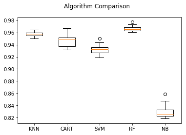
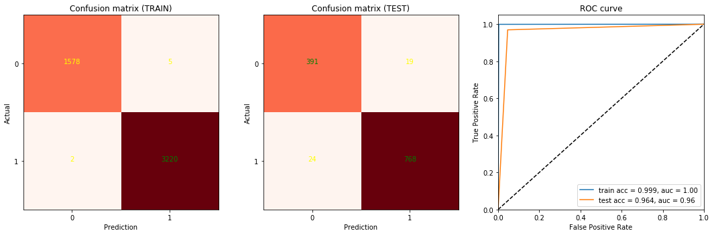
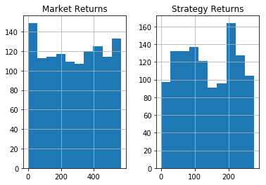
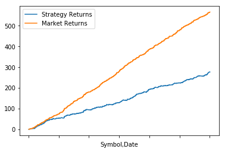

# Algorithm Trading with Machine Learning Methodologies


## Team Members

Perfect Yayra Gidisu  1702010695

Mathilde Bouvier      1702010703

Faruk Yucel           1702010705


## Introduction
```
"Better stock prices direction prediction is a key reference for better trading strategy and decision
making by ordinary investors and financial experts" (Kap, Chiu, Lu and Yang; 2013).
```

## Objective

Our project aims to implement a momentum strategy based on Machine Learning methods. The data consists of Date, Open, High, Low, Last and Volume. We calculated our predictors based on various technical indicators i.e. Exponential Moving Average, Stochastic Oscillator %K and %D, Relative Strength Index (RSI), Rate Of Change (ROC), Momentum (MOM) on which model was trained in order to forecast the signal for buy and sell. We create a Simple Moving Averages (SMA) of a time series with differing lookback periods, 30 days and 120 days. If the short moving average exceeds the long moving average then we go long, if the long moving average exceeds the short moving average then we exit. 

## Feature Selection

Exponential Moving Average (= exponentially weighted moving average) = similar to the simple moving average however more weight is given to the latest data resulting in a faster reaction to recent price changes.

Stochastic Oscillator %K and %D = momentum indicator that compare, over a certain period of time, the closing price of a security to the range of its prices. 
```
Where %K = 100(C - L14) / (H14 - L14)
C = the most recent closing price
L = the low of the 14 previous trading sessions
H14 = the highest price traded during the same 14-day period
%K= the current market rate for the currency pair
%D = 3-period moving average of %K
```

Relative Strength Index (RSI) = momentum indicator that compare, over a certain period of time, the magnitude of recent gains and losses to measure speed and change of price movements of a security.
```
Where: RSI = 100 - 100 / (1 + RS)
RS = Average gain of up/loss of down periods during the specified time frame.
```

Rate Of Change (ROC) = ratio between a change in one variable relative to a corresponding change in another.

Momentum (MOM) = rate of acceleration of a security's price or volume. It is an oscillator and is used to help identify trend lines.

## Data

We pulled the daily historical data from Morningstar. We chose 4 stocks (BIDU, MSFT, AAPL and TXN) in the technology sector of the NASDAQ. The time period is from 01/01/12 to 31/12/17.

## Model

We realized the following methods:
- KNN
- Decision Tree
- Random Forest
- SVM
- Gaussian Naïve Bayes


KNN:  0.957338 (0.004066)

CART: 0.947136 (0.011638)

RF:   0.966495 (0.004955)

SVM:  0.932570 (0.008892)

NB:   0.830599 (0.012240)




## Results








## References

- Leung, C.K.S., MacKinnon, R.K. and Wang, Y., 2014, July. A machine learning approach for stock price prediction. In Proceedings of the 18th International Database Engineering & Applications Symposium (pp. 274-277). ACM.
- Madge, S. and Bhatt, S., 2015. Predicting Stock Price Direction using Support Vector Machines. Independent Work Report Spring.
- Teixeira, L.A. and De Oliveira, A.L.I., 2010. A method for automatic stock trading combining technical analysis and nearest neighbor classification. Expert systems with applications, 37(10), pp.6885-6890.
